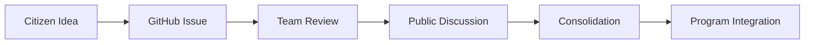

# Contribution Charter

## Overview

The Contribution Charter defines the rules and principles governing citizen participation in the Audierne2026 initiative.

## Core Principles

### 1. Openness
- All contributions are welcome
- No prior expertise required
- Multiple languages accepted

### 2. Respect
- Constructive dialogue only
- No personal attacks
- Focus on ideas, not individuals

### 3. Transparency
- All discussions are public
- Decision-making process is documented
- Sources are cited

### 4. Non-Partisan
- No political party affiliation
- Focus on local issues
- Evidence-based proposals

## Contribution Process

### Phase 1: Submission
- Citizens submit ideas via GitHub issues or web forms
- Anonymous submissions allowed
- Team adds context and labels

### Phase 2: Discussion
- Issues migrated to GitHub Discussions
- Community debates proposals
- TRIZ analysis for contradictions

### Phase 3: Consolidation
- Weekly consolidation reports
- Common themes identified
- Contradictions flagged for resolution

### Phase 4: Integration
- Validated proposals enter program
- Implementation roadmap created
- Progress tracked publicly

## Categories

Contributions are organized into themes:

| Category | Description |
|----------|-------------|
| `economie` | Local economy, jobs, businesses |
| `logement` | Housing, urban planning |
| `culture` | Arts, heritage, events |
| `ecologie` | Environment, sustainability |
| `associations` | Community organizations |
| `jeunesse` | Youth programs |
| `alimentation-bien-etre-soins` | Food, health, wellness |

## Resources

- [Contribution form](https://audierne2026.fr/contribuer/)
- [GitHub Discussions](https://github.com/audierne2026/participons/discussions)
- [RESPECT_CHARTE workflow](https://audierne2026.fr/contribuer/#charte-de-contribution)
